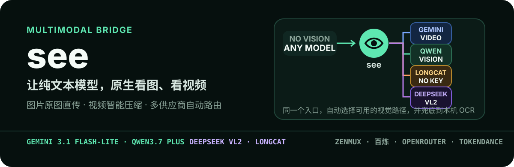

<p align="center">
  
</p>

Analyze images, screenshots, and videos, produce readable media reports, and use local text recognition when relevant. SeeGui, the desktop app, closes the whole lifecycle: it installs the See Skill and the global `see` CLI, uninstalls them at any time, configures providers and screenshot options, and monitors recognition and installation logs.

## Do Not Drag Images Here

If the host rejects image attachments before the Skill starts, request a readable local path; do not conclude that every host rejects attachments.

Save the image locally, provide a path or URL, or explicitly invoke `$see`:

```text
Use see to look at /Users/me/Desktop/error.png
```

```text
$see
```

Configuring credentials does not change global rules. Installing the Skill only affects the local machine; the `~/.codex/AGENTS.md` rule that works around rejected image attachments is an optional host adapter and is written only when explicitly requested.

## Install SeeGui (Recommended)

Download the installer for your platform from GitHub Releases:

| Platform | Installer |
|---|---|
| Windows | `SeeGui-1.0.20260918-windows-x64-setup.exe` |
| macOS | `SeeGui-1.0.20260918-macos-<arch>.dmg` |
| Linux | `SeeGui-1.0.20260918-linux-x86_64.AppImage` |

Pushing a `v*` tag makes GitHub Actions build all three installers and create or update a Release. Re-pushing the same version tag replaces the old artifacts.

After launching SeeGui, use the three tabs to complete the loop:

1. **Config**: choose a provider (ZenMux, Bailian, OpenRouter, TokenDance, LongCat, custom, or local), enter the API URL, key, and model, then verify and save. The "Screenshot & Local Options" section below it configures the output directory, OCR backend, OCR languages, and parallel job count.
2. **Install / Status**: click "Install / Update Global Components" to install the See Skill into `~/.codex/skills/see` and the global CLI into `~/.local/bin/see` (Windows: `%APPDATA%\see\bin\see.cmd`) and add it to PATH. You can then run `see` from any directory. To uninstall, check the Skill, CLI, AGENTS rule, config file, system credentials, or usage log and click "Run Selected Uninstall".
3. **Logs**: recognition start, success, failure, installation, uninstallation, and config saves are recorded in `~/.config/see/usage.log` (Windows: `%APPDATA%\see\usage.log`). The log tab shows the latest 200 entries, success/failure counts, and supports refresh and clear. Logs never include API keys or raw media content.

Installing the Skill does not replace the model in the corner of the host app. It is normal for the original text model to remain; `see` calls the vision backend only when media is analyzed.

Using the built-in local provider requires no multimodal API key at all.

## Direct Usage

Tell the AI where the image is and what you want, just like normal:

```text
Look at /path/to/screenshot.png
```

```text
Read the error in /path/to/error.png and explain how to fix it
```

```text
Look at a.png, b.png, and c.png in parallel
```

```text
Compare the UI changes between before.png and after.png
```

```text
Summarize /path/to/demo.mp4
```

The AI only needs one command. After SeeGui installs the global CLI, use `see` directly:

```bash
# Single image
see screenshot.png

# Independent multi-image analysis, parallel by default
see a.png b.png c.png

# Joint multi-image understanding
see --together before.png after.png --task "Compare the UI changes"

# Full video understanding
see demo.mp4
```

Without the global CLI, the in-repo equivalent is `see/scripts/see.sh <arguments>`.

## Why This Is Closer To Native Vision

- Images are sent as-is, without pre-OCR, resizing, or compression.
- Videos keep the full timeline and audio and use the model's native video capability; the Skill does not extract frames.
- 4K, high-frame-rate, or large videos are automatically compressed into a clear H.264 MP4 to reduce upload time.
- Your question is passed through with `--task` and is not wrapped in a fixed report template.
- The vision model understands objects, layout, spatial relationships, UI state, and text together.
- Cloud results return directly to the host model, reducing the information loss caused by generic description followed by second-round reasoning.

A text-only host model still receives text output, so this can never be identical to native vision in the same model; it is the lowest-loss way to attach an external vision model.

## Parallel And Joint Modes

| Scenario | Mode | Behavior |
|---|---|---|
| Unrelated images | Default | Parallel requests, results grouped by input order |
| Before/after, screenshots, combined evidence | `--together` | All originals enter one multimodal request |
| Only local capability available | Automatic fallback | Images continue to be analyzed in parallel |

## Providers

| Provider | Default Model | Key Variable |
|---|---|---|
| ZenMux | `qwen/qwen3.7-plus` | `ZENMUX_API_KEY` |
| Bailian | `qwen3.7-plus` | `DASHSCOPE_API_KEY` |
| OpenRouter | `qwen/qwen3.7-plus` | `OPENROUTER_API_KEY` |
| TokenDance | `qwen3.7-plus` | `TOKENDANCE_API_KEY` |
| LongCat / CC Switch | `deepseek-v4-flash-vision-exp` | Local CC Switch, no key needed |
| Custom (OpenAI-compatible) | User-defined | `CUSTOM_BASE_URL` / `CUSTOM_MODEL` / `CUSTOM_API_KEY` |
| Local | System vision / OCR | None |

Images try providers in configuration order and fall back to local vision only when all cloud providers fail; videos use the separate routing below.

`longcat` does not make the LongCat 2.0 host model itself accept images. It reuses the local CC Switch proxy to call a vision-capable model on the same relay. The default URL is `http://127.0.0.1:15721/v1`; override the port with `LONGCAT_BASE_URL` and the model with `LONGCAT_MODEL`. This adapter is not in the automatic routing; enable it with `--provider longcat` or `SEE_PROVIDER=longcat`.

`custom` works with any OpenAI-compatible vision endpoint. The API URL uses `CUSTOM_BASE_URL`, the image model uses `CUSTOM_MODEL`, and the key uses `CUSTOM_API_KEY`; the video model uses `CUSTOM_VIDEO_MODEL` and defaults to `CUSTOM_MODEL`.

```bash
# Option A: terminal guide, key stored in the system credential store
python3 see/scripts/onboard.py --provider custom

# Option B: environment variables or project .env.local
export CUSTOM_BASE_URL=https://api.example.com/v1
export CUSTOM_MODEL=vision-model
export CUSTOM_API_KEY=sk-...
see/scripts/see.sh image.png --provider custom
```

Automatic video model selection:

| Provider | Default Video Model | Input |
|---|---|---|
| ZenMux | `google/gemini-3.1-flash-lite` | Full video + audio |
| OpenRouter | `google/gemini-3.1-flash-lite` | Full video + audio |
| Bailian | `qwen3.7-plus` | Full video |
| TokenDance | `qwen3.7-plus` | Full video |
| Custom | User-defined, defaults to `CUSTOM_MODEL` | Full video (depends on the endpoint) |

Videos never degrade to frame extraction; without a cloud key with video support, the tool tells you to configure one.

## Onboard And Key Storage

SeeGui is the recommended way to configure providers and install global components; new keys use a local page and cloud execution goes through the run wrapper for that provider. The legacy Onboard remains for terminal configuration, routing changes, and local mode when the user explicitly chooses it:

```bash
python3 see/scripts/onboard.py
# Only to modify global rules when explicitly requested:
python3 see/scripts/onboard.py --install-agents
python3 see/scripts/onboard.py --status
```

Private config locations:

- macOS / Linux: `~/.config/see/config.env`
- Windows: `%APPDATA%\see\config.env`

The config file stores the provider, model, and a reference to the system credential store. It is readable and writable only by the current user; new keys are not written to it. Environment variables have the highest priority and are useful for CI or users who prefer not to persist keys; project `.env.local` comes next, and the private config file comes last.

Advanced users can also set:

```bash
export SEE_PROVIDER=zenmux
# ZENMUX_API_KEY is injected by a trusted runtime, never typed into command text
```

Never commit real keys to Git.

## SeeGui Lifecycle

SeeGui is written in Tkinter and packaged as a three-platform desktop app. The installer carries the complete See Skill resources, so global install and uninstall work offline:

- **Install**: "Install / Update Global Components" installs the See Skill into `~/.codex/skills/see`, creates the global `see` command, adds it to PATH, and optionally writes the image-rejection override rule to `~/.codex/AGENTS.md`.
- **Status**: the page shows the Skill version and path, the CLI path and PATH state, and whether the AGENTS rule is present.
- **Uninstall**: select items and run the removal for the Skill, global CLI, AGENTS rule, config file, system credentials, and usage logs independently.
- **Logs**: recognition start / success / failure plus install, uninstall, and config events are written to a JSONL log; the page shows the latest 200 entries, success/failure statistics, and supports refresh and clear.

Run the source version directly:

```bash
python3 see/scripts/gui.py
```

Leaving the API key empty preserves any key already stored in the system credential store. Keys are never written to the config file or logs.

GitHub Actions builds all desktop installers, and local builds are supported:

| Platform | Artifact |
|---|---|
| Windows | NSIS installer (`SeeGui-<version>-windows-x64-setup.exe`) |
| macOS | DMG (`SeeGui-<version>-macos-<arch>.dmg`) |
| Linux | AppImage (`SeeGui-<version>-linux-x86_64.AppImage`) |

Pushing a `v*` tag makes CI build and release all three installers. Local builds use `python3 packaging/build_installers.py --installer nsis|dmg|appimage`; see [packaging/README.md](packaging/README.md).

## Local Fallback

```text
macOS   -> System Vision OCR -> Tesseract
Windows -> Windows OCR       -> Tesseract
Linux   -> Tesseract
```

macOS Vision works through the system `osascript` and needs no Xcode, Swift, or extra key. If the machine has Swift, enhanced analysis is enabled automatically. Windows OCR is also a system capability but requires OCR languages to be installed. Tesseract is a final fallback and must be installed by the user.

The macOS Swift-enhanced path also returns scene classification, people/faces, barcodes, and basic shape structure; those signals still cannot replace full semantic understanding from a multimodal model. Other local paths are primarily OCR.

Check local backends:

```bash
python3 see/scripts/onboard.py --status
```

If something is unavailable:

- macOS: upgrade to macOS 10.15 or newer.
- Windows: Settings -> Time & Language -> Language & region -> Language options, install OCR.
- Ubuntu / Debian: `sudo apt install tesseract-ocr tesseract-ocr-chi-sim`.

## Arguments

Daily use only needs image paths. Use other arguments on demand:

| Argument | Purpose |
|---|---|
| `--task "question"` | Passed through to the vision model unchanged |
| `--together` | Put multiple images in one request |
| `--jobs 4` | Parallelism for multiple images |
| `--provider NAME` | Temporarily choose a provider |
| `--model NAME` | Temporarily override the current media model |
| `--ocr-backend system` | Choose the local system capability |
| `-o result.md` | Choose the result file |

On success, stdout only prints:

```text
output_path=/absolute/path/result.md
```

The result Markdown records the actual backend, model, single/parallel/joint mode, and whether each route succeeded, so the AI can tell whether fallback happened.

## Support Scope

- Local images, videos, and HTTP / HTTPS URLs.
- Parallel multi-file analysis; `--together` for joint multi-image understanding.
- Videos are compressed to at most 1920 on the long edge, 2 fps at the compact tier, H.264 and AAC; a smaller preset is used automatically when upload budget is exceeded.
- Download limit: 512 MB.
- No extraction of web video.
- Requires Python 3; cloud calls do not depend on third-party Python packages.
- Video compression requires FFmpeg.

## File Structure

```text
see/
├── SKILL.md
├── agents/
│   └── openai.yaml
└── scripts/
    ├── see.sh
    ├── onboard.py
    ├── parse_media.py
    ├── usage_log.py
    ├── gui.py
    ├── ocr_macos.js
    ├── ocr_macos.swift
    └── ocr_windows.ps1
```

## License

[MIT](./LICENSE) Copyright (c) 2026 tyza66

## Credentials And Data Boundaries

Cloud analysis sends the selected media to the chosen provider and may incur fees; local OCR is not equivalent to full visual understanding. New keys are saved into the system credential store through the bundled local page; regular config only stores references. First install the task Python requirements `see/scripts/requirements-credentials.txt` (relative path inside the Skill: `scripts/requirements-credentials.txt`). Never put keys into chat messages, command arguments, or logs; usage logs record only events, providers, models, counts, and sanitized errors, never keys or media content. Legacy plaintext configs are not migrated or overwritten automatically: the flow stops and asks you to back up before reconfiguring. Status checks only confirm the source; a successful API verification is what proves availability. Global rule writes happen only when `--install-agents` is explicitly called or when SeeGui installation is run with the AGENTS option checked.

## API Key Configuration Page

The first time an external provider is used, you can enter the key yourself on the local page; existing configs are reused and keys are stored in the system credential store. Configure only the providers you actually use; pure local processing needs no key. The page requires Node.js 22.18+ and an available system credential service; the runtime still uses the original dependencies.

Installation, status checks, page opening, and credential-aware runs are documented in [API Key Setup](see/references/api-key-setup.md). Page saves and business reads are connected; keys are never sent into chat and old files are not migrated automatically.
